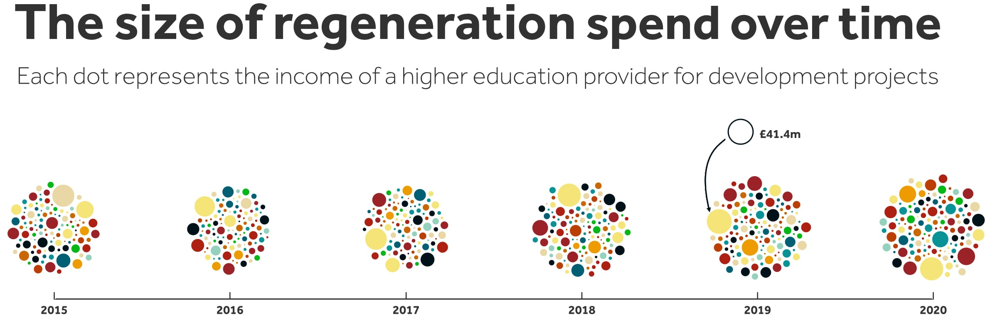
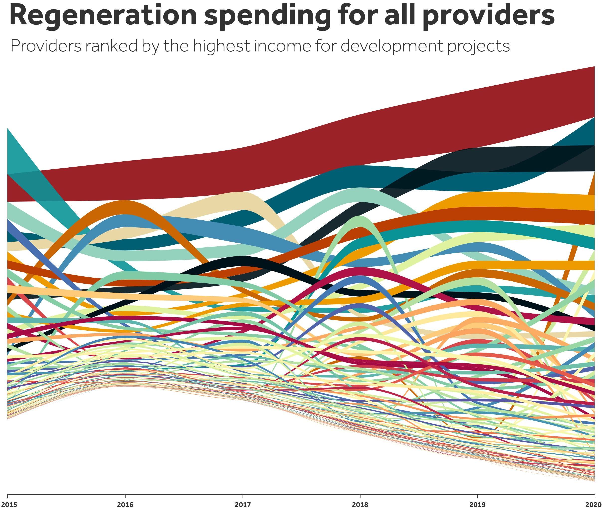
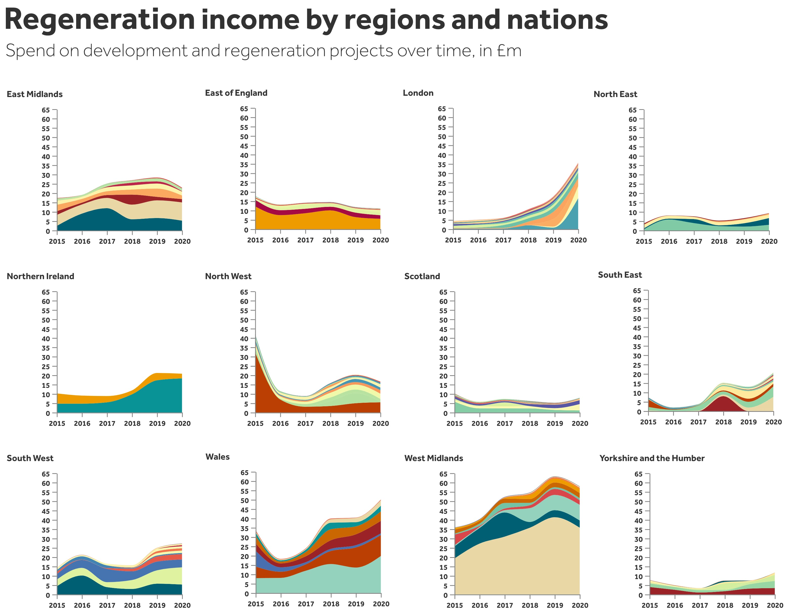
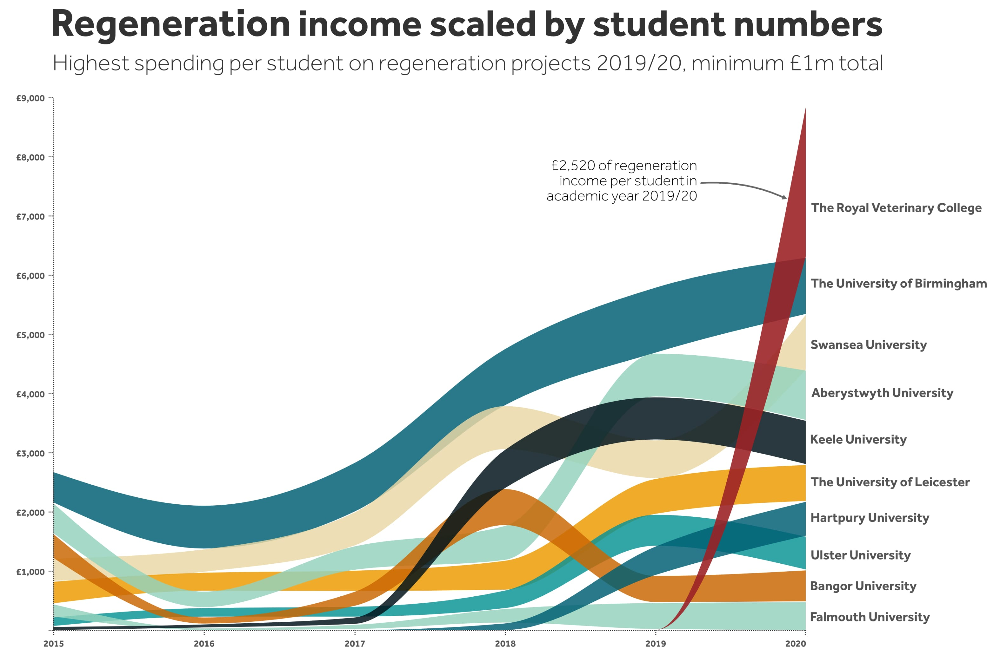

 Visualising the funding of individual higher education providers over time. 

The Levelling Up White Paper promises to ‘transform derelict urban sites into beautiful communities’, to boost people’s skills, and support local businesses. It also includes a commitment to ‘vastly simplify the local growth funding landscape’. 

Much of this funding will be channelled through the [UK Shared Prosperity Fund](https://www.gov.uk/government/publications/uk-shared-prosperity-fund-pre-launch-guidance/uk-shared-prosperity-fund-pre-launch-guidance) (UKSPF), the successor to EU Structural and Investment Funds (ESIF). But [concerns have been raised](https://www.lgcplus.com/politics/devolution-and-economic-growth/shared-prosperity-fund-devo-offer-not-real-devolution-18-02-2022/) about reduced funding pots, shorter timeframes and superficial objectives. Local growth funding matters for universities, who have a track record of delivering skills and employment programmes, innovation and incubation centres, and many other projects at local level. Using HESA data we can visualise the scale of this activity over the past six years.

For the past four years regeneration income – funding awarded to universities to spend on local development projects – has increased, to a total of £292m in 2020 (figure 1). Based on these figures, regeneration funding is [forecast to total £2.5 billion](https://wonkhe.com/blogs/universities-can-drive-economic-recovery-if-everyone-plays-their-part/) over the next five years. But, as [Universities UK have stressed](https://www.universitiesuk.ac.uk/latest/news/local-communities-facing-skills-training), progress is threatened by funding gaps between local growth programmes.

We can track the funding of individual higher education providers over time (figure 2). Whilst the picture is a little messy, it tells us several important things. First, that whilst relative rankings can shift, for many institutions their spending in this area is consistent from year-to-year – shown by the thickness of each band. Second, the ten providers with the highest level of regeneration income in 2020 accounted for over £143m of activity – nearly half of the total. Sitting at the top is the University of Birmingham (with around a third of its regeneration funding from ESIF), followed by the universities of Swansea (nearly all from ESIF) and Ulster (about a fifth from ESIF).

Given the focus of levelling up policy and the UKSPF on reducing spatial inequalities, breaking this data down by region and UK nation shows us areas where expertise is at risk of being lost through reduced funding, and other areas where investment should be boosted (figure 3 – each band represents a provider). The West Midlands performs strongly, powered in large part by the University of Birmingham. London, Northern Ireland, the South East and Wales show sharp rises in recent years, in some cases due to an individual provider scaling up their activity.

These figures obscure some smaller providers punching above their weight. If we adjust regeneration income on the basis of student numbers, the Royal Veterinary College jumps to the top (figure 4). Hartpury University and Hartpury College, a specialist agriculture and veterinary institution in Gloucester, also ranks high.

Sitting behind these figures are staff with deep expertise on how universities can work with partners to transform funding streams into local impact. When we shifted from the 2007-2013 to the 2014-2020 ESIF funding cycles, the ‘gap’ in funding led to widespread fears of this expertise leaving universities, with long-lasting implications for local areas. This time, given the radical change in funding programmes, the gap risks becoming a chasm.

_A version of this post originally appeared on the [NCEE website](https://ncee.org.uk/2022/04/04/university-regeneration-activity-in-four-visualisations/)._


Note on sources: The [data on income from regeneration and development programmes](https://www.hesa.ac.uk/data-and-analysis/providers/business-community/table-3) is from the HESA Higher Education - Business and Community Interaction survey 2019/20. Totals exclude capital income attributable to survey year – some of the tables may look quite different if this is included. Note also that these totals do not necessarily include all local development activity funded by higher education providers. Income is also somewhat dependent on allocations made to local areas through the likes of the ESIF and Local Growth Fund programmes. The [data on student numbers](https://www.hesa.ac.uk/data-and-analysis/students/table-1) is from the 2020/21 HESA student dataset. Timelines are academic years – 2015/16 becomes 2016.


